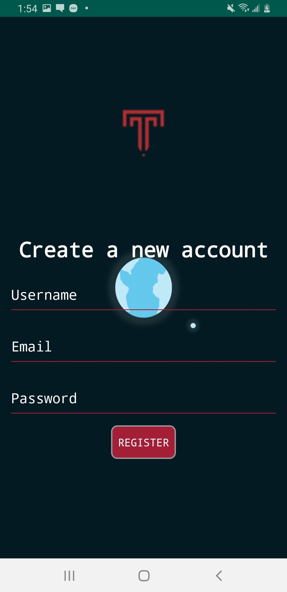
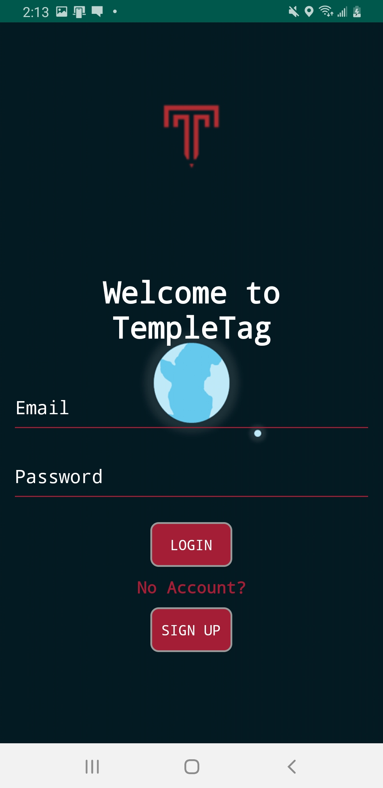
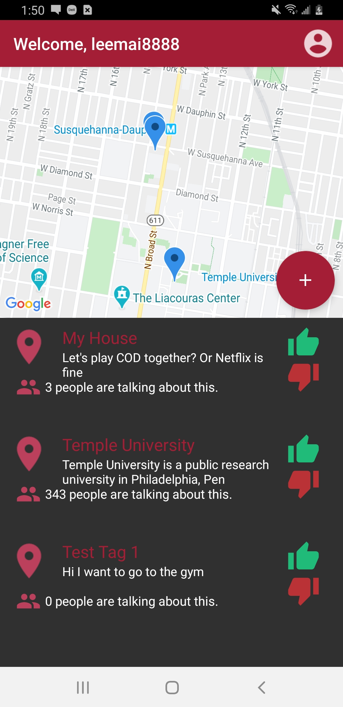
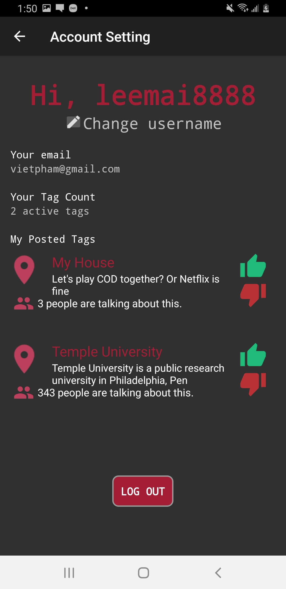
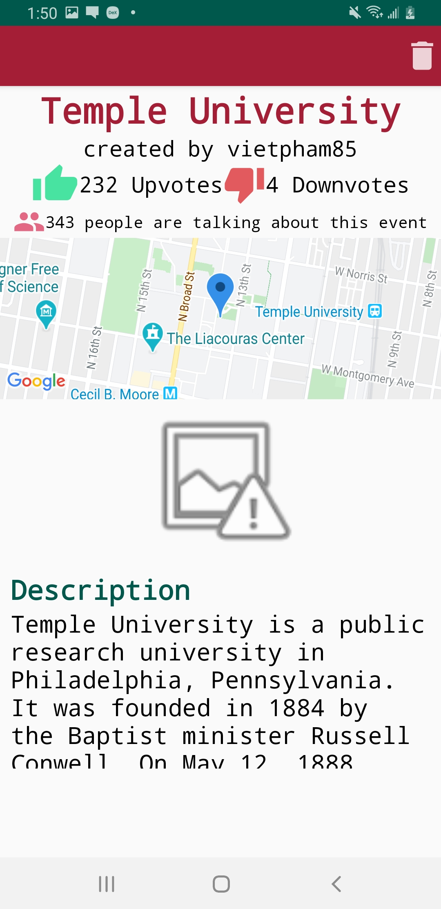
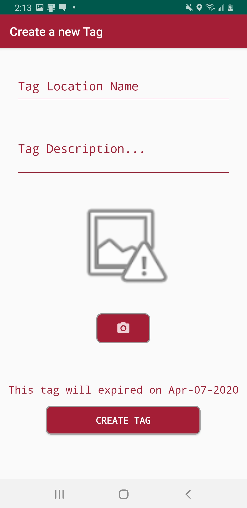

# TempleTag

#### Semester project for Group 3 of CIS 4515 completed in Spring 2020
+ [Dillon Coffman](https://github.com/dilloncoffman)
+ [Viet Pham](https://github.com/viethphamvn)
+ [Zach Essel](https://github.com/zessel)
+ [Andrey Sokolov](https://github.com/Nephoros)

#### TempleTag is a social local event tracker for Android devices.
Find or tag nearby goings-ons and vote for your favorites.
More popular locations get more map real estate.
Old tags are culled after 24 hours or a negative reception, so there is always something new to discover.

## Login & Signup Screen

 

## Home Screen

## Others

  

#### Technologies Used 

FireBase FireStore for tag and user data  
FireBase Storage for images  
Google Maps for mapping

#### Required Permissions

Camera  
Location services
